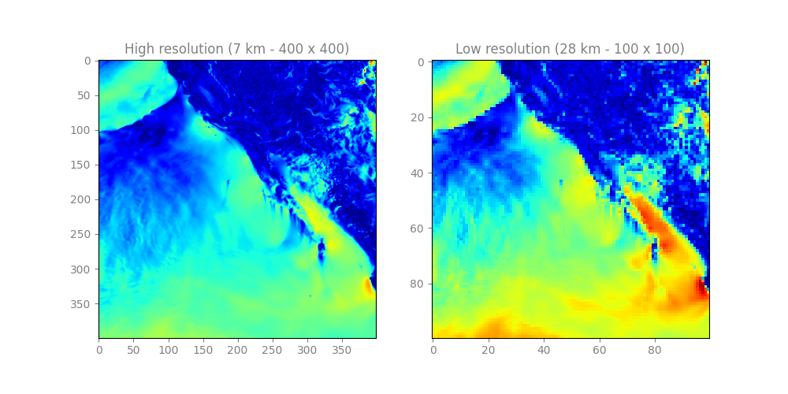

# WindSR Dataset (Super-resolution dataset for satellite wind speed)

<div align="center">
  <a href="https://github.com/sekilab/WindSR_Dataset">
    
  </a>
</div>


The WindSR Dataset contains more than 22,000 pairs of low-resolution/high-resolution wind speed images. The dataset is divided into two sets: a training set and a testing set. The training set encompasses 20,046 samples, each consisting of two wind speed measurements. One measurement comprises a high-resolution image with dimensions of (400, 400), representing wind speed data at a resolution of 7 km. The second measurement consists of a lower-resolution image with dimensions of (100, 100), representing the same wind speed data but at a resolution of 28 km. The testing set contains 2,102 samples and mirrors the structure of the training set, with each sample comprising a pair of wind speed measurements at different resolutions. WindSR dataset can be used for training super-resolution models focused on satellite data.


Here is a sample HR/LR pair from the WindSR dataset:

<div align="center">



To understand how the dataset is prepared, you can read our paper published in the IEEE Access journal.
<a href="https://ieeexplore.ieee.org/document/10174644"><strong>WindSR: Improving Spatial Resolution of Satellite Wind Speed Through Super-Resolution»</strong></a>

</div>


## Download dataset
### Training dataset (20,046 samples)
- [hr_train 400 x 400](https://sekilab-public-data.s3.ap-northeast-1.amazonaws.com/WindSR_Dataset/hr_train.npy)
- [lr_train 100 x 100](https://sekilab-public-data.s3.ap-northeast-1.amazonaws.com/WindSR_Dataset/lr_train.npy)

### Validation dataset (2,102 samples)

- [hr_test 400 x 400](https://sekilab-public-data.s3.ap-northeast-1.amazonaws.com/WindSR_Dataset/hr_test.npy)
- [lr_test 100 x 100](https://sekilab-public-data.s3.ap-northeast-1.amazonaws.com/WindSR_Dataset/lr_test.npy)


## Loading dataset

To load the datasets and check their shapes, you can use the following Python code:

```python
import numpy as np

# Load the arrays
HR_TRAIN = np.load('hr_train.npy')
LR_TRAIN = np.load('lr_train.npy')

# Print the shapes
print('HR_TRAIN shape:', HR_TRAIN.shape)
print('LR_TRAIN shape:', LR_TRAIN.shape)
```

## Citation

- If you use this dataset in your research, please cite the following article. Thank you!
  
```csv
@ARTICLE{10174644,
  author={Kumar, Ashutosh and Islam, Tanvir and Ma, Jue and Kashiyama, Takehiro and Sekimoto, Yoshihide and Mattmann, Chris},
  journal={IEEE Access}, 
  title={WindSR: Improving Spatial Resolution of Satellite Wind Speed Through Super-Resolution}, 
  year={2023},
  volume={11},
  number={},
  pages={69486-69494},
  doi={10.1109/ACCESS.2023.3292966}}
```
